<!--
  Profile README for github.com/randomwhitehat
  Lives in a PUBLIC repo named exactly: randomwhitehat
  Files in that repo:  README.md  +  banner.svg

  TODO: link NOLA's Devpost page (and the repo, if it goes public) in Side projects.
-->

Backend engineer from Malaysia. I lead a team by day and build systems that are supposed to stay up.
Lately I've been building AI agents, mostly to find out where they break.

  &nbsp;
  &nbsp;
  &nbsp;
  &nbsp;
  &nbsp;
  &nbsp;
  &nbsp;
  &nbsp;
  &nbsp;
  &nbsp;
  &nbsp;
  &nbsp;
  &nbsp;
  &nbsp;
  &nbsp;
  &nbsp;
  

also: FastEndpoints · gRPC · Dapper · EF Core · IdentityServer · Google ADK · Pydantic · Codex · Antigravity

### Work

Closed source, names withheld.

- **Multi-tenant e-invoicing platform**: per-tenant isolation, SSO and caching. I led the architecture and backend.
- **Workflow & approval engine**: clients configure multi-level approval chains and rules without code changes.
- **AI document OCR**: extracts structured data from documents, with config-driven switching between models and API keys.
- **API gateway**: one entry point with a shared REST + gRPC model for the services behind it.
- **Self-service onboarding**: new client setup went from hours to minutes.

### Side projects

**NOLA** is an insurance-claims agent built for the *All Things Agentic Hackathon* (2026). I did the backend and the agent, and [@Vyvienne](https://github.com/Vyvienne) did the frontend.

It works from an email inbox. It reads the damage photos, checks the policy, and either settles a small claim or hands it to a human with its reasoning. It has no tool for denying a claim, and its payout cap is enforced in code.
 Python · Google ADK · Gemini · Cloud Run · Firestore · Pub/Sub

### How I build

- Guardrails go in code, not in the prompt.
- Every write should be safe to retry.
- Pin what you depend on, including the model version.
- Write the decision down.

---

[LinkedIn](https://www.linkedin.com/in/tan-kent/) · break it, understand it, build it better.
